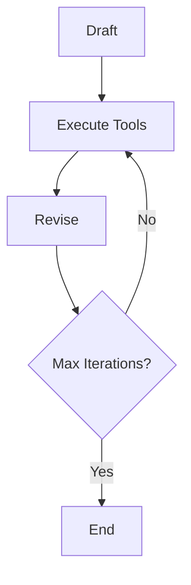

# 🤖 Reflexion Agent

An intelligent AI-powered research agent that uses self-reflection and iterative improvement to generate comprehensive, well-researched answers on any topic.

## 🌟 Features

- **Self-Reflective AI**: Uses advanced reflection mechanisms to critique and improve its own responses
- **Iterative Research**: Automatically searches for additional information to enhance answer quality
- **Multi-Stage Processing**: Draft → Research → Revise cycle for optimal results
- **Google Vertex AI Integration**: Powered by Gemini 2.5 Flash for high-quality responses
- **Automated Web Search**: Integrates Tavily search for real-time information gathering

## 🏗️ Architecture

The Reflexion Agent follows a sophisticated multi-node workflow:



### Core Components

- **Draft Node**: Generates initial 250-word response with self-reflection
- **Execute Tools**: Performs web searches based on identified knowledge gaps
- **Revise Node**: Improves the answer using search results and citations
- **Event Loop**: Controls iteration flow with configurable max attempts

## 📁 Project Structure

```
Reflexion_Agent/
├── main.py              # Main application entry point
├── chains.py            # LangChain prompt templates and chains
├── schemas.py           # Pydantic models for structured outputs
├── tool_executer.py     # Web search tool execution logic
├── pyproject.toml       # Project dependencies and metadata
├── .env                 # Environment variables (API keys)
└── service-account.json # Google Cloud service account credentials
```

## 🚀 Quick Start

### Prerequisites

- Python 3.12+
- Google Cloud Project with Vertex AI enabled
- Tavily API key for web search

### Installation

1. **Clone the repository**
   ```bash
   git clone <https://github.com/Divyanshu9382/Reflexion-Agent.git>
   cd Reflexion_Agent
   ```

2. **Install dependencies**
   ```bash
   pip install -r requirements.txt
   # or using poetry
   poetry install
   ```

3. **Set up environment variables**
   Create a `.env` file with:
   ```env
   TAVILY_API_KEY=your_tavily_api_key_here
   ```

4. **Configure Google Cloud**
   - Place your service account JSON file in the project root
   - Update the project ID in `chains.py`

### Usage

Run the agent with a custom query:

```python
python main.py
```

Or modify the query in `main.py`:

```python
res = graph.invoke(
    {"messages": ["Your research question here"]}
)
```

## 🔧 Configuration

### Customizing Behavior

- **Max Iterations**: Modify `MAX_ITERATIONS` in `main.py` (default: 3)
- **Response Length**: Adjust word count in `schemas.py` and `chains.py`
- **Search Results**: Change `max_results` in `tool_executer.py`

### Model Configuration

Update the LLM model in `chains.py`:

```python
llm = ChatVertexAI(model="gemini-2.5-flash")  # or gemini-pro, etc.
```

## 📊 Example Output

**Query**: "Write about AI-Powered SOC and startups that raised capital."

**Generated Essay**: A comprehensive 250-word analysis covering:
- AI-Powered SOC technology overview
- Key capabilities and benefits
- Notable startups (Darktrace, SentinelOne, CrowdStrike, Cylance)
- Investment trends and market insights

## 🛠️ Technical Details

### Dependencies

- **LangChain**: Framework for LLM applications
- **LangGraph**: State graph orchestration
- **Google Vertex AI**: LLM provider
- **Tavily**: Web search API
- **Pydantic**: Data validation and parsing

### Key Features

- **Structured Output**: Uses Pydantic models for consistent response format
- **Tool Binding**: Automatic tool selection and execution
- **State Management**: Maintains conversation context across iterations
- **Error Handling**: Graceful handling of API failures and edge cases

## 🤝 Contributing

1. Fork the repository
2. Create a feature branch
3. Make your changes
4. Add tests if applicable
5. Submit a pull request

## 📄 License

This project is licensed under the MIT License - see the LICENSE file for details.

## 👨‍💻 Author

**Divyanshu9382**
- Email: divyanshu9382@gmail.com

---

*Built with ❤️ using LangChain and Google Vertex AI*
